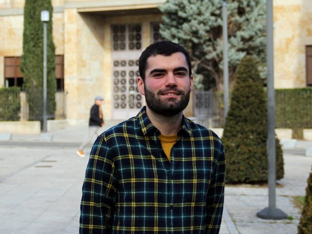

# About

This book contains the material for the **Fundamentals and Introduction to Machine Learning** block of the Advanced Programming course in the Computer Engineering degree at the University of Salamanca (USAL).

Citation information, BibTeX, DOI and Zenodo metadata are collected on the [How to Cite](92_how_to_cite.md) page.

## How this book is made

This website is written in Markdown files and Jupyter notebooks, and converted to HTML and PDF using tools from [TeachBooks](https://teachbooks.io/), [Jupyter Book](https://jupyterbook.org/) and [MyST Markdown](https://mystmd.org/).

The source files are stored in a public GitHub repository:

- https://github.com/dmjimenezbravo/ml-teachbook-usal

The published version of the book can be viewed at:

- https://dmjimenezbravo.github.io/ml-teachbook-usal/

## About the author

```{raw} html
<div class="author-profile-grid">
  <article class="author-profile-card">
    
    <div>
      <h3>Diego M. Jiménez Bravo</h3>
      <p class="author-profile-role">Permanent Lecturer, Computer Science and Automation</p>
      <div class="author-profile-links">
        <a href="https://produccioncientifica.usal.es/investigadores/148175/detalle?lang=en">USAL profile</a>
        <a href="https://orcid.org/0000-0002-0291-7627">ORCID</a>
      </div>
    </div>
  </article>
</div>
```

````{container} pdf-author-fallback
```{image} ../_static/authors/diego_m_jimenez_bravo.jpg
:alt: Portrait of Diego M. Jiménez Bravo
:width: 35%
:align: center
```

**Diego M. Jiménez Bravo**  
Permanent Lecturer, Computer Science and Automation

- USAL profile: https://produccioncientifica.usal.es/investigadores/148175/detalle?lang=en
- ORCID: https://orcid.org/0000-0002-0291-7627
````

### Institution

Faculty of Sciences, University of Salamanca (USAL).

Photographs and academic profile information come from the University of Salamanca scientific production portal.
